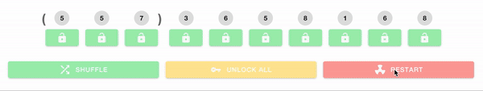

# ionic4-phone-spinner

[](https://www.npmjs.com/package/@flubs/ionic4-phone-spinner/)
[](https://www.npmjs.com/package/@flubs/ionic4-phone-spinner)
[](https://www.npmjs.com/package/@flubs/ionic4-phone-spinner)



## Index ##

* [About](#about)
* [Setup](#setup)
* [Documentation](#documentation)
* [Issues](#issues)
* [Contributing](#contributing)

## About ## 

This is a bad phone number picker for Angular 2+ and Ionic 4+. 

* Try out [the demo](https://ionic4-phone-spinner.jrquick.com) to see it in action!
* Checkout my other Ionic/Angular projects: [ionic4-tooltips](https://github.com/jrquick17/ionic4-tooltips) and [ionic4-auto-complete](https://github.com/jrquick17/ionic4-auto-complete)!
* Visit [my website](https://jrquick.com) for other cool projects!

## Setup ##

### Install ###
Install
```
npm i ionic4-phone-spinner --save
```

### Import ###
Import within your module
```typescript
import {NgModule} from '@angular/core';
import {IonicModule} from '@ionic/angular';

import {Ionic4PhoneSpinnerModule} from '@flubs/ionic4-phone-spinner';

@NgModule({
  ...
  imports: [
    ...
    IonicModule,
    Ionic4PhoneSpinnerModule,
    ...
  ]
})
export class MyBadAppModule {}
```

## Documentation ##

### Attributes ###

* `[number]` - The phone number
* `[options]` - Customize the lock options ([see below](#options))
* `(change)` - Emitted when the phone number changes

#### Options ####

* `buttons` - List of features to apply to the control buttons ([see below](#button-options))
* `locks` - List of features to apply to the lock button ([see below](#lock-options))
* `shuffleMilliseconds` - Number of milliseconds to wait between digit changes
* `shufflesPerClick` - Number of times to change unlocked digits
* `unlocks` - List of features to apply to the unlock button ([see below](#lock-options))

##### Button Options #####

* `ALLOW_RANDOM_COLORS` - Adds additional random colors to buttons.
* `ALLOW_RANDOM_ICONS` - Adds additional random icons to buttons.
* `CHANGE_AFTER_UNLOCK_ALL` - Change button styles after unlock all.
* `CHANGE_AFTER_LOCK` - Change button styles after locking a digit.
* `CHANGE_AFTER_RESTART` - Change button styles after restart.
* `CHANGE_AFTER_SHUFFLE` - Change button styles after shuffle.
* `CHANGE_AFTER_UNLOCK` - Change button styles after unlocking a digit.
* `CHANGE_CONTINUOUSLY` - Change button styles constantly and at random.
* `UPDATE_COLOR` - When updating button style change the color.
* `UPDATE_FILL` - When updating button style change the fill.
* `UPDATE_ICON` - When updating button style change the icon.
* `UPDATE_POSITION` - When updating button style change the position.
* `UPDATE_SIZE` - When updating button style change the size.
* `UPDATE_TEXT` - When updating button style change the text.

##### Lock Options #####

* `DIFFERENT` - The incorrect digit locks/unlocks on click.
* `IGNORE` - Lock/Unlock button sometimes ignores clicks
* `LIAR` - Sometimes the lock/unlock is not actually unlocked/locked.
* `ORDER` - The locks must be locked in order (left to right).
* `REVERT` - Locks/unlocks randomly change state.
* `REVERSE` - The locks must be locked in reverse order (right to left).
* `SHUFFLE` - Lock toggles after each shuffle.

## Issues ##

You're welcome! Are bugs not features? You can [submit a pull request](https://github.com/flubs-stuff/ionic4-phone-spinner/pulls) or [report an issue](https://github.com/flubs-stuff/ionic4-phone-spinner/issues).

### Demo ###

* [Check it out here!](https://ionic4-phone-spinner.jrquick.com)

#### Run ####

Go to demo directory
Run `npm install` to get the required packages 
Run `ionic serve` to run the demo

## Contributing ##


### Thanks ###

* [jrquick17](https://github.com/jrquick17)
